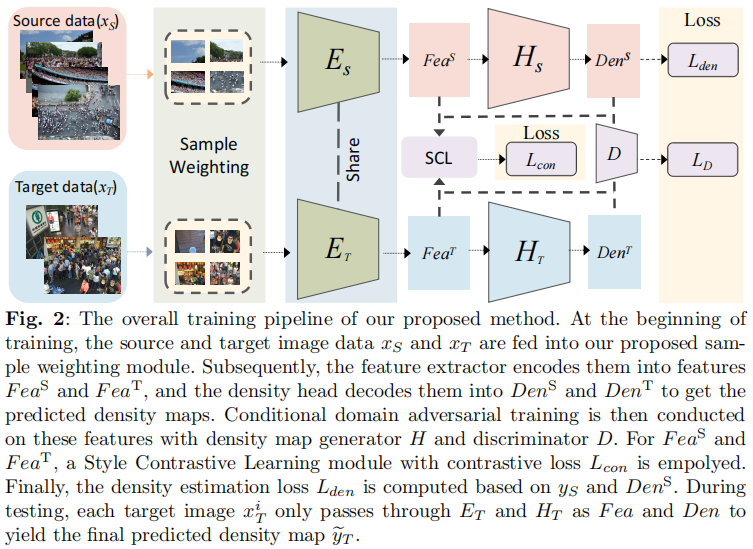

# Advancing Crowd Counting Accuracy in Diverse Environments via Comprehensive Domain Alignment Strategies
## Introduction

[//]: # (This is the official PyTorch implementation of paper: [**STEERER: Resolving Scale Variations for Counting and Localization via Selective Inheritance Learning**]&#40;https://arxiv.org/abs/2308.10468&#41;, which effectively addressed the issue of scale variations for object counting and localizaioion, demonstrating the state-of-arts counting and localizaiton performance for different catagories, such as crowd,vehicle, crops and trees )


The code is currently being reorganized and updated.

# Getting started 

## Training

we provide simplify script to run distributed or cluster training,

```bash
sh configs/SHHA_2_QNRF.sh

```


 

## Testing

To reproduce the performance, run the similry command like training,


```bash
sh configs/SHA_eval_QNRF.sh 

```


